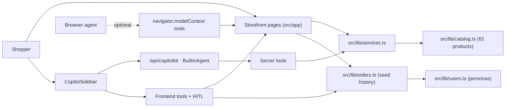

# Architecture

Voltti is a single Next.js App Router application. A deterministic, in-memory domain layer (`src/lib/`) owns all product facts and commerce logic; two access paths sit on top of it — the storefront UI and the CopilotKit agent. Neither path may fork business logic.

## Domain Layer

- `src/lib/types.ts` — `Product`, `Compat` (socket, memory type, watts, GPU length, case clearance), `CartLine`, `SearchFilters`, `CheckoutDetails`, `Order` (+ `userId`/`status`/`deliveredAt`), `UserProfile`, `PersonaId`, `ReturnEligibility`, `OwnedPart`.
- `src/lib/catalog.ts` — the product array (61) plus `featuredIds` and `categoryMeta`. No I/O.
- `src/lib/services.ts` — pure functions: `searchProducts`, `getAlternatives`, `checkCompatibility` (optionally cross-order via `owned`), `recommendPcBuild`, `recommendGamingSetup`, cart math, `formatDate`, and `productSummary` (compact shape that keeps agent payloads small).
- `src/lib/users.ts` — three mock personas + `guest`. Static seed data (demo-only; ships in the client bundle).
- `src/lib/orders.ts` — seed order history (relative days materialized once at module load), `getOrdersFor` (paginated), `getOrderDetail`, `returnEligibility` (computed), `ownedHardwareProfile` (derived ≤6-entry profile).

Everything is deterministic and runs identically on the server (route handler, prerendered pages) and in the browser (client components, frontend tools).

## Customer Memory & Identity

Four decisions shape how customer data reaches the agent:

1. **Identity-scoped data goes through frontend tools, not server tools.** `getMyOrders`/`getReturnInfo` read the active persona client-side, so identity is never a model-supplied `userId` (the anti-pattern real systems must avoid). Catalog/compat tools stay server-side because they're user-independent. *Production carry-over: identity resolved by infrastructure, never the model.*
2. **Owned hardware is a derived profile in context; raw orders stay behind tools.** Proactive knowledge (the agent must spontaneously catch a conflict) must be always-on, so it's a bounded ≤6-entry profile. Reactive knowledge (order history, returns) is paginated behind tools. Derive small stable facts for context; paginate everything else; never echo raw history.
3. **The saved address never transits the model.** `prefillCheckout(useSavedAddress)` copies it straight into checkout state; context carries only `hasSavedAddress: true`.
4. **Returns are computed, never reasoned.** `returnEligibility()` returns an explicit deadline; the prompt forbids model date math. The `proposeCartUpdate` card additionally runs a client-side compat safety net so a conflict shows at approval time regardless of model diligence.

## Access Path 1: Storefront UI

Routes in `src/app/`: `/` (hero, category tiles, top deals, featured), `/c/[slug]` for 8 categories, `/deals`, `/search`, `/product/[id]`, `/cart`, `/checkout`. Category and product pages are statically generated from the catalog.

Listings are rendered by `CatalogBrowser` (`src/components/catalog-browser.tsx`). **The URL query string is the source of truth for filter state** — `q`, `max`, `brands`, `deals`, `stock`, `sort`. Sidebar clicks write params with `router.replace`; the agent's `browseCatalog` tool writes the same params with `router.push`. Both produce identical, shareable listing state.

## Access Path 2: The Agent

- `src/app/api/copilotkit/route.ts` — `CopilotRuntime` + `BuiltInAgent` (model from `COPILOTKIT_MODEL`) with six server tools that wrap `services.ts`, and **system prompt v2** (personality, novice/expert calibration, per-flow playbooks, guardrails).
- `src/components/copilot/shopping-assistant.tsx` — the client half: `CopilotSidebar`, `useAgentContext` (derived/bounded: user, owned-hardware profile, path, cart, comparison ids, checkout completeness), frontend tools that steer the UI (incl. identity-scoped `getMyOrders`/`getReturnInfo`), human-in-the-loop approval cards (with the compat safety net), persona-aware suggestions, and `useRenderTool` renderers that turn tool results into cards in chat.
- `src/app/providers.tsx` — wraps the app in `CopilotKitProvider` and `ShopProvider`.

See [agent-contract.md](agent-contract.md) for the full tool surface and rules.

## State Model

Client state lives in `ShopProvider` (`src/lib/shop-context.tsx`), accessed via `useShop()`:

- **Cart** — persisted to localStorage under `voltti.cart.v1`; hydration is guarded by a `hydrated` flag to avoid SSR mismatches.
- **Active persona** — `activeUser`/`personaId`, persisted under `voltti.user.v1`. `setActiveUser` keeps the cart but clears highlights/compare and resets the checkout draft to the persona's (non-PII) defaults.
- **Session orders** — orders placed this session, under `voltti.session-orders.v1`, merged with the seed history for `/account` and `getMyOrders`.
- **Compare selection** (max 4) and comparison-modal visibility.
- **Highlighted product ids** — set by the agent to draw attention in listings.
- **Checkout draft** — partial `CheckoutDetails`, edited by the form, the agent's `prefillCheckout`, and `applySavedAddress` (the shared code path for the checkout "Use saved address" button and `prefillCheckout(useSavedAddress)`).
- **Last order** — set by `placeOrder`, which stamps the active persona, generates a fake order number, and clears the cart.

Listing filter state deliberately does *not* live here — it lives in the URL (above).

## WebMCP (Progressive Enhancement)

`src/lib/webmcp.ts` registers `search_catalog`, `open_page`, and `add_to_cart` on `navigator.modelContext` when a browser supports it. Everything is feature-detected and try/catch-wrapped; in normal browsers it is a no-op.

## Deployment

The Dockerfile builds the Next app and runs `next start` on port 3000; `docker-compose.yml` passes the model and provider keys as environment variables.
