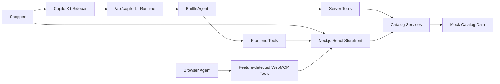

# Architecture

SignalCart is a single Next.js App Router application with a local domain service layer and a CopilotKit runtime endpoint. The UI and the agent both use the same catalog logic so product facts, compatibility checks, and recommendation behavior do not drift.



## Main Modules

- `src/app/page.tsx`: Renders the main commerce experience.
- `src/app/providers.tsx`: Wraps the app with `CopilotKitProvider`.
- `src/app/api/copilotkit/route.ts`: Creates the CopilotKit runtime and BuiltInAgent.
- `src/components/commerce-experience.tsx`: Contains the storefront, frontend tools, agent context, HITL cart approval, and WebMCP registration.
- `src/lib/catalog.ts`: Curated mock inventory.
- `src/lib/services.ts`: Search, alternatives, gaming setup recommendation, cart total, and compatibility checks.
- `src/lib/types.ts`: Shared domain types.

## Data Flow

The UI reads catalog data through service functions such as `searchProducts`, `recommendGamingSetup`, and `checkCompatibility`.

The CopilotKit BuiltInAgent gets server-side tools in `route.ts`. These tools call the same service functions as the UI. The agent can also call frontend tools registered in `commerce-experience.tsx` to navigate pages, apply filters, highlight products, open comparisons, and draft carts.

The app shares current state with the agent using `useAgentContext`. This includes the current page, filters, visible products, cart, selected comparison products, and compatibility warnings.

## Runtime Shape

The runtime endpoint is `/api/copilotkit`. It uses `CopilotRuntime` and `BuiltInAgent` from CopilotKit v2.

The model is selected through:

```bash
COPILOTKIT_MODEL=openai/gpt-4o-mini
```

The provider key must match the provider prefix in the model string:

- `openai/...` uses `OPENAI_API_KEY`
- `anthropic/...` uses `ANTHROPIC_API_KEY`
- `google/...` uses `GOOGLE_API_KEY`

## State Model

The main shopping state tracks:

- Current storefront page
- Filters and budget
- Shortlist
- Comparison candidates
- Recommendation summary and tradeoffs
- Cart draft
- Pending approval

Mutable state lives in React. Durable commerce storage is intentionally deferred.

## Deployment Model

The Docker setup builds the Next app and runs `next start` on port `3000`. Runtime secrets are passed as environment variables.
