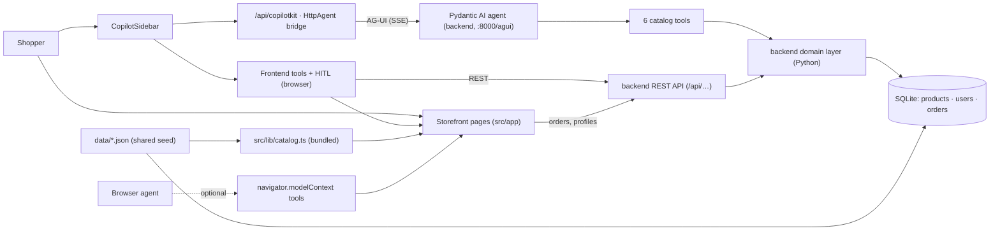

# Architecture

Voltti is two services. The **storefront** is a Next.js App Router application; the **agent backend** is a uv-managed Python service (FastAPI) hosting the shopping agent (Pydantic AI, speaking AG-UI), the deterministic domain logic, a REST API, and a SQLite database. The agentic system — prompt, tools, model — lives entirely in the backend and can be changed and deployed without touching the storefront.

## Data Ownership

| Data | Source of truth | How each side gets it |
|---|---|---|
| Product catalog (61 products) | `data/catalog.json` (static seed) | Next.js imports it (static generation, instant UI); backend seeds SQLite from it at startup |
| Demo personas | `data/users.json` (static seed) | Same dual consumption (demo-only: personas ship in the client bundle) |
| **Orders** (history + newly placed) | **Backend SQLite only** | Storefront and agent tools read/write over REST; nothing order-related is stored client-side anymore |

Seeded demo orders (`VLT-1xxx`/`VLT-2xxx`) are regenerated with fresh relative dates on every backend startup, so the demo always shows an open return window, a freshly closed one, and an in-transit order. Orders placed through the UI/chat persist across restarts.

## Domain Layer (backend)

`backend/src/voltti_backend/domain/` is a faithful Python port of the original TypeScript logic:

- `catalog.py` — `search_products`, `get_alternatives`, `product_summary` (compact shape that keeps agent payloads small).
- `compat.py` — `check_compatibility`: CPU socket vs motherboard, memory generation, GPU length vs case, PSU headroom, stock; optionally cross-order via `owned` with per-purchase attribution.
- `builds.py` — `recommend_pc_build` (budget-share allocator, platform-consistent), `recommend_gaming_setup`.
- `orders.py` — `return_eligibility` (computed, never reasoned), paginated summaries, order detail, `owned_hardware_profile` (derived ≤6-entry profile), order-number generation.
- `format.py` — byte-identical `formatPrice`/`formatDate` ports (the strings are embedded in tool results).

**Parity is enforced, not assumed**: `scripts/generate-parity-fixtures.ts` runs the TypeScript implementation over a fixed input matrix and `backend/tests/test_parity.py` asserts the Python port produces identical output — ids, totals, and exact strings. Regenerate fixtures whenever `src/lib/services.ts` changes.

The storefront keeps a client-side copy of search/compat helpers (`src/lib/services.ts`) for instant listing filters, the compare tray, and the HITL safety net — operating on the same shared catalog JSON and covered by the same fixtures.

## Customer Memory & Identity

Four decisions shape how customer data reaches the agent:

1. **Identity-scoped data goes through frontend tools, not agent tools.** `getMyOrders`/`getReturnInfo` read the active persona client-side and call the backend REST API (`/api/users/{persona}/orders/…`) — identity is never a model-supplied `userId`. Catalog/compat tools live in the agent because they're user-independent. *Production carry-over: identity resolved by infrastructure (session → API), never the model.*
2. **Owned hardware is a derived profile in context; raw orders stay behind tools.** The backend computes the bounded ≤6-entry profile (`/api/users/{persona}/agent-profile`); the frontend publishes it via `useAgentContext`. Reactive knowledge (order history, returns) is paginated behind tools.
3. **The saved address never transits the model.** `prefillCheckout(useSavedAddress)` copies it straight into checkout state; context carries only `hasSavedAddress: true`.
4. **Returns are computed, never reasoned.** `return_eligibility()` returns an explicit deadline; the prompt forbids model date math. The `proposeCartUpdate` card additionally runs a client-side compat safety net so a conflict shows at approval time regardless of model diligence.

## Access Path 1: Storefront UI

Routes in `src/app/`: `/` (hero, category tiles, top deals, featured), `/c/[slug]` for 8 categories, `/deals`, `/search`, `/product/[id]`, `/cart`, `/checkout`, `/account`. Category and product pages are statically generated from the shared catalog JSON.

Listings are rendered by `CatalogBrowser` (`src/components/catalog-browser.tsx`). **The URL query string is the source of truth for filter state** — `q`, `max`, `brands`, `deals`, `stock`, `sort`. Sidebar clicks write params with `router.replace`; the agent's `browseCatalog` tool writes the same params with `router.push`.

Order placement (`shop.placeOrder`) POSTs to `/api/orders`; the `/account` page and order tools read back from the backend.

## Access Path 2: The Agent

- `backend/src/voltti_backend/agent/prompt.md` — the system prompt (personality, novice/expert calibration, per-flow playbooks, guardrails). **Edit this file to change agent behavior; no application code involved.**
- `backend/src/voltti_backend/agent/agent.py` — the Pydantic AI agent: model from `AGENT_MODEL`/`COPILOTKIT_MODEL` env, six catalog tools (names unchanged, so the storefront's generative-UI renderers keep working), and a dynamic instructions function that injects the live app context.
- `backend/src/voltti_backend/main.py` — the AG-UI endpoint (`POST /agui`). One subtlety: the AG-UI adapter does not surface `RunAgentInput.context` (what `useAgentContext` sends) by itself, so the endpoint extracts it from the request body into per-request deps. `UsageLimits(request_limit=10)` mirrors the old `maxSteps: 10`.
- `src/app/api/copilotkit/route.ts` — a thin bridge: `CopilotRuntime` + `HttpAgent` (from `@ag-ui/client`) pointing at `AGENT_URL`, with `ExperimentalEmptyAdapter` (no LLM calls happen in Next.js anymore).
- `src/components/copilot/shopping-assistant.tsx` — the client half: `CopilotSidebar`, `useAgentContext` (derived/bounded: user, owned-hardware profile from the backend, path, cart, comparison ids, checkout completeness), frontend tools that steer the UI (incl. identity-scoped `getMyOrders`/`getReturnInfo` backed by REST), human-in-the-loop approval cards (with the compat safety net), persona-aware suggestions, and `useRenderTool` renderers that turn tool results into cards in chat.

See [agent-contract.md](agent-contract.md) for the full tool surface and rules.

## State Model

Client state lives in `ShopProvider` (`src/lib/shop-context.tsx`), accessed via `useShop()`:

- **Cart** — persisted to localStorage under `voltti.cart.v1`; hydration is guarded by a `hydrated` flag to avoid SSR mismatches. The cart is pre-transactional UI state, so it stays client-side.
- **Active persona** — `activeUser`/`personaId`, persisted under `voltti.user.v1`. `setActiveUser` keeps the cart but clears highlights/compare and resets the checkout draft to the persona's (non-PII) defaults.
- **Compare selection** (max 4) and comparison-modal visibility.
- **Highlighted product ids** — set by the agent to draw attention in listings.
- **Checkout draft** — partial `CheckoutDetails`, edited by the form, the agent's `prefillCheckout`, and `applySavedAddress` (the shared code path for the checkout "Use saved address" button and `prefillCheckout(useSavedAddress)`).
- **Last order** — set by `placeOrder` after the backend confirms; placing an order POSTs to the backend and clears the cart.

Orders are **not** client state anymore (the old `voltti.session-orders.v1` localStorage key is gone) — the backend DB owns them. Listing filter state lives in the URL (above).

## WebMCP (Progressive Enhancement)

`src/lib/webmcp.ts` registers `search_catalog`, `open_page`, and `add_to_cart` on `navigator.modelContext` when a browser supports it. Everything is feature-detected and try/catch-wrapped; in normal browsers it is a no-op.

## Deployment

`docker-compose.yml` runs both services: the backend (uv image, port 8000, SQLite in a volume-less demo configuration) and the storefront (Node image, port 3000) wired together via `AGENT_URL`. For dev, `./scripts/dev.sh` runs both with reload.
