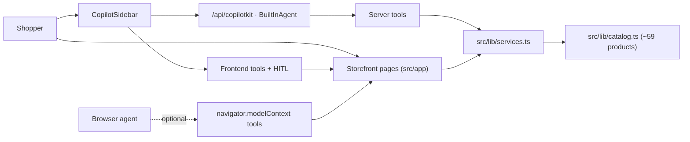

# Architecture

Voltti is a single Next.js App Router application. A deterministic, in-memory domain layer (`src/lib/`) owns all product facts and commerce logic; two access paths sit on top of it — the storefront UI and the CopilotKit agent. Neither path may fork business logic.

## Domain Layer

- `src/lib/types.ts` — `Product`, `Compat` (socket, memory type, watts, GPU length, case clearance), `CartLine`, `SearchFilters`, `CheckoutDetails`, `Order`.
- `src/lib/catalog.ts` — the product array plus `featuredIds` and `categoryMeta`. No I/O.
- `src/lib/services.ts` — pure functions: `searchProducts`, `getAlternatives`, `checkCompatibility`, `recommendPcBuild` (budget-allocating part picker), `recommendGamingSetup` (prebuilt advisor), cart math, and `productSummary` (compact shape that keeps agent payloads small).

Everything is deterministic and runs identically on the server (route handler, prerendered pages) and in the browser (client components, frontend tools).

## Access Path 1: Storefront UI

Routes in `src/app/`: `/` (hero, category tiles, top deals, featured), `/c/[slug]` for 8 categories, `/deals`, `/search`, `/product/[id]`, `/cart`, `/checkout`. Category and product pages are statically generated from the catalog.

Listings are rendered by `CatalogBrowser` (`src/components/catalog-browser.tsx`). **The URL query string is the source of truth for filter state** — `q`, `max`, `brands`, `deals`, `stock`, `sort`. Sidebar clicks write params with `router.replace`; the agent's `browseCatalog` tool writes the same params with `router.push`. Both produce identical, shareable listing state.

## Access Path 2: The Agent

- `src/app/api/copilotkit/route.ts` — `CopilotRuntime` + `BuiltInAgent` (model from `COPILOTKIT_MODEL`) with six server tools that wrap `services.ts`.
- `src/components/copilot/shopping-assistant.tsx` — the client half: `CopilotSidebar`, `useAgentContext` (shares current path, cart, comparison ids, checkout-form completeness), frontend tools that steer the UI, human-in-the-loop approval cards, and `useRenderTool` renderers that turn server tool results into product cards in chat.
- `src/app/providers.tsx` — wraps the app in `CopilotKitProvider` and `ShopProvider`.

See [agent-contract.md](agent-contract.md) for the full tool surface and rules.

## State Model

Client state lives in `ShopProvider` (`src/lib/shop-context.tsx`), accessed via `useShop()`:

- **Cart** — persisted to localStorage under `voltti.cart.v1`; hydration is guarded by a `hydrated` flag to avoid SSR mismatches.
- **Compare selection** (max 4) and comparison-modal visibility.
- **Highlighted product ids** — set by the agent to draw attention in listings.
- **Checkout draft** — partial `CheckoutDetails`, edited by the form and by the agent's `prefillCheckout` tool.
- **Last order** — set by `placeOrder`, which generates a fake order number and clears the cart.

Listing filter state deliberately does *not* live here — it lives in the URL (above).

## WebMCP (Progressive Enhancement)

`src/lib/webmcp.ts` registers `search_catalog`, `open_page`, and `add_to_cart` on `navigator.modelContext` when a browser supports it. Everything is feature-detected and try/catch-wrapped; in normal browsers it is a no-op.

## Deployment

The Dockerfile builds the Next app and runs `next start` on port 3000; `docker-compose.yml` passes the model and provider keys as environment variables.
