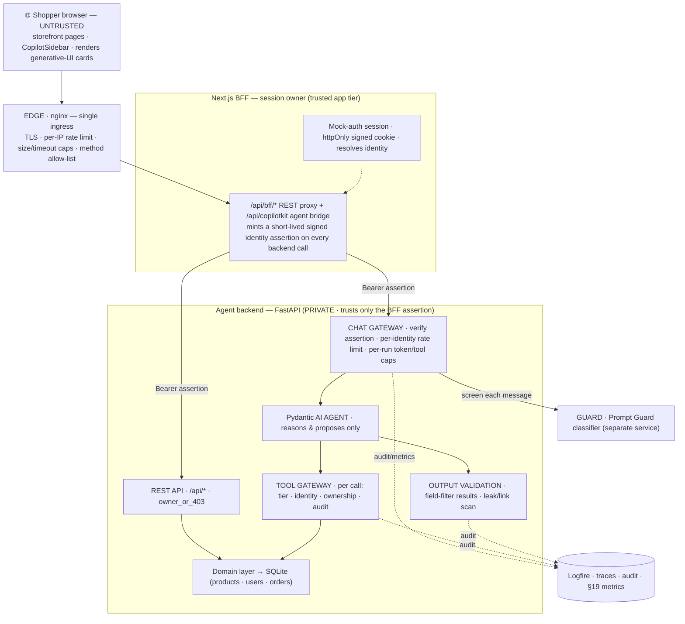

# Architecture

> **As built.** This documents Voltti as it works **today**, after the security-hardening effort — identity, authorization, edge, input safety, output validation, and observability are all in place. For the *why* behind each control read the [security principles](security-principles.md); for the step-by-step flow of each layer (with sequence diagrams) read the [as-built security flows](security-implementation.md); for the tool risk-tiers and the PII field table read the [layer classification](layer-classification.md).

Voltti is **three services** behind a single edge. The **storefront** is a Next.js App Router app that also acts as a **Backend-for-Frontend (BFF)** — it owns the session and is the only thing that talks to the backend. The **agent backend** is a uv-managed Python service (FastAPI) hosting the shopping agent (Pydantic AI, speaking AG-UI), the deterministic domain logic, a REST API, and a SQLite database. The **guard** is a small, separate FastAPI service wrapping a prompt-injection classifier. In production topology an **nginx edge** is the only ingress; the browser never reaches the backend or guard directly.



The agentic system — prompt, tools, model — lives entirely in the backend and can be changed and deployed without touching the storefront.

## Trust boundaries & where each control lives

Identity is decided by the server and never asserted by the browser; every boundary the data crosses has a control. This is the map; each row's mechanism is detailed in [security-implementation.md](security-implementation.md).

| Boundary | Control | Where | Principle |
|---|---|---|---|
| Browser → edge | TLS, per-IP rate limit, body-size/timeout caps, method allow-list | nginx ([voltti.conf](../deploy/nginx/voltti.conf)) | P7 |
| Browser → BFF | Mock-auth session in an httpOnly **signed** cookie; identity resolved server-side | Next BFF ([session.ts](../src/lib/session.ts)) | P4 |
| BFF → backend | Short-lived **signed identity assertion** (HS256) on a private channel; backend rejects anything else | [bff proxy](../src/app/api/bff/%5B...path%5D/route.ts) → [security.py](../backend/src/voltti_backend/security.py) | P4 |
| User message → agent | **Input-safety guard** screens each message before the model; flagged → refused, never runs | chat gateway → [guard](../guard/) | P3/P7 |
| Chat volume → agent | Per-identity rate limit + per-run token/tool caps (denial-of-wallet) | [ratelimit.py](../backend/src/voltti_backend/ratelimit.py), `UsageLimits` | P7 |
| Agent → tools | Tool gateway authorizes every call (tier, identity, ownership, audit) | [policy.py](../backend/src/voltti_backend/agent/policy.py) | P2/P5 |
| REST → user data | Ownership check: asserted identity must own the resource | [routes.py](../backend/src/voltti_backend/api/routes.py) `owner_or_403` | P2/P4 |
| Tool result / agent output → user | **Output validation**: drop deny-listed PII/secret fields; scan text for leaks/links | [output_validation.py](../backend/src/voltti_backend/agent/output_validation.py) | P6 |
| Repeat abuse | Per-identity decaying abuse score → progressive enforcement | [abuse.py](../backend/src/voltti_backend/abuse.py) | P3/P7 |
| Every layer | Trace + audit + metrics (no raw prompts/PII) | Logfire ([observability.py](../backend/src/voltti_backend/observability.py)) | P7 |

## Identity & sessions (the BFF)

The active persona is **server state**, not a browser value. Selecting a persona is a mock login: the browser `POST`s to [`/api/session`](../src/app/api/session/route.ts), and the BFF sets a signed, httpOnly `voltti_session` cookie ([session.ts](../src/lib/session.ts)). The browser holds no `userId` of record and no backend URL.

Every browser→backend call goes through the BFF, which reads the cookie and **mints a short-lived signed assertion** (a 60-second HS256 JWT over the shared `INTERNAL_JWT_SECRET`) that it attaches as a `Bearer` token:
- REST → the same-origin proxy at [`/api/bff/[...path]`](../src/app/api/bff/%5B...path%5D/route.ts);
- the agent → the [`/api/copilotkit`](../src/app/api/copilotkit/route.ts) bridge, which forwards it to the backend `/agui`.

The backend verifies the assertion ([security.py](../backend/src/voltti_backend/security.py)) and reads identity from it — **never** from the request path or body. The secret lives only on the servers, so a browser cannot forge an identity. The credential is mock (no real IdP); the *enforcement* is real.

## Access Path 1: Storefront UI

Routes in `src/app/`: `/` (hero, category tiles, top deals), `/c/[slug]` for 8 categories, `/deals`, `/search`, `/product/[id]`, `/cart`, `/checkout`, `/account`. Category and product pages are statically generated from the shared catalog JSON.

Listings are rendered by `CatalogBrowser` ([catalog-browser.tsx](../src/components/catalog-browser.tsx)). **The URL query string is the source of truth for filter state** — `q`, `max`, `brands`, `deals`, `stock`, `sort`. Sidebar clicks write params with `router.replace`; the agent's `browseCatalog` tool writes the same params with `router.push`.

All data calls go to the same-origin BFF ([api.ts](../src/lib/api.ts) → `/api/bff/*`), never the backend directly. Order placement (`shop.placeOrder`) POSTs through the BFF to `/api/orders`, where the backend attributes the order to the **session identity**, ignoring any body `userId`.

## Access Path 2: The Agent

A chat turn travels: browser → `/api/copilotkit` (BFF bridge, attaches the assertion) → backend `/agui`. At the backend the turn passes a gauntlet before and after the model:

```mermaid
sequenceDiagram
    participant B as Browser chat
    participant N as Next /api/copilotkit (BFF)
    participant P as Backend /agui (chat gateway)
    participant G as Guard
    participant M as Pydantic AI agent
    B->>N: message (session cookie)
    N->>P: AG-UI run · Bearer <assertion>
    P->>P: verify assertion → identity; rate-limit; abuse level
    P->>G: POST /classify (input safety, P3)
    alt flagged
        G-->>P: blocked
        P-->>N: refusal stream — model never runs
    else clean
        P->>M: run agent (token/tool caps)
        M->>M: tool calls → tool gateway (tier/identity/audit) → output filter
        M-->>N: streamed reply + tool results (generative UI)
    end
    N-->>B: renders cards / refusal
```

- **Backend agent** ([agent.py](../backend/src/voltti_backend/agent/agent.py)) — the Pydantic AI agent: model from `AGENT_MODEL`, six read-only catalog tools (`tool_plain`), two identity-scoped tools (`getMyOrders`/`getReturnInfo`, `@agent.tool`, scoped to `deps.identity` — **no `userId` parameter** the model could supply), and a dynamic-instructions function that injects the live app context. Its toolset is wrapped by the output-validation layer.
- **System prompt** ([prompt.md](../backend/src/voltti_backend/agent/prompt.md)) — personality, calibration, per-flow playbooks, and the ground rules (claims come from tools; dates are quoted not computed; output-safety rules against prompt/secret disclosure). **Edit this file to change agent behavior; no application code involved.**
- **Bridge** ([route.ts](../src/app/api/copilotkit/route.ts)) — `CopilotRuntime` + `HttpAgent` pointing at the backend, with `ExperimentalEmptyAdapter` (no LLM calls happen in Next.js).
- **Client half** ([shopping-assistant.tsx](../src/components/copilot/shopping-assistant.tsx)) — `CopilotSidebar`, `useAgentContext` (derived/bounded: persona, owned-hardware profile from the backend, path, cart, comparison ids, checkout completeness), frontend **UI-steering** tools, human-in-the-loop approval cards (with a compat safety net), and `useRenderTool` renderers that turn tool results into cards. **Generative-UI rendering stays client-side** — the hardening moved *trust and data* server-side, not the rendering.

See [agent-contract.md](agent-contract.md) for the full tool surface and rules.

## Data Ownership

| Data | Source of truth | How each side gets it |
|---|---|---|
| Product catalog (61 products) | `data/catalog.json` (static seed) | Next imports it (static generation); backend seeds SQLite from it at startup |
| Demo personas | `data/users.json` (static seed) | Backend seeds SQLite; the BFF mock-login surface lists personas **without PII** (no emails) |
| **Orders** (history + placed) | **Backend SQLite only** | Read/written over REST through the BFF, scoped to the session; nothing order-related is client-side |

Seeded demo orders (`VLT-1xxx`/`VLT-2xxx`) are regenerated with fresh relative dates on every backend startup, so the demo always shows an open return window, a freshly closed one, and an in-transit order. Orders placed through the UI/chat persist across restarts.

## Domain Layer (backend)

`backend/src/voltti_backend/domain/` is a faithful Python port of the original TypeScript logic:

- `catalog.py` — `search_products`, `get_alternatives`, `product_summary` (compact shape that keeps agent payloads small).
- `compat.py` — `check_compatibility`: CPU socket vs motherboard, memory generation, GPU length vs case, PSU headroom, stock; optionally cross-order via `owned` with per-purchase attribution.
- `builds.py` — `recommend_pc_build` (budget-share allocator, platform-consistent), `recommend_gaming_setup`.
- `orders.py` — `return_eligibility` (computed, never reasoned), paginated summaries, order detail, `owned_hardware_profile` (derived ≤6-entry profile), order-number generation.
- `format.py` — byte-identical `formatPrice`/`formatDate` ports (the strings are embedded in tool results).

**Parity is enforced, not assumed**: `scripts/generate-parity-fixtures.ts` runs the TypeScript implementation over a fixed input matrix and `backend/tests/test_parity.py` asserts the Python port produces identical output — ids, totals, and exact strings. The storefront keeps a client-side copy of search/compat helpers ([services.ts](../src/lib/services.ts)) for instant listing filters, the compare tray, and the HITL safety net — same catalog JSON, same fixtures.

## What reaches the model (PII discipline, P6)

Customer data reaches the agent only in bounded, non-PII form, and this is enforced at three points:

1. **Identity-scoped data is a backend tool, not browser-supplied.** `getMyOrders`/`getReturnInfo` read `deps.identity` (from the assertion) and return *summaries* (order number/status/dates/total/line-item names) — never email, address, or full name.
2. **The saved address never transits the model.** `prefillCheckout(useSavedAddress)` copies it into checkout state client-side; context carries only `hasSavedAddress: true`.
3. **Output validation backstops it.** Every tool result is filtered against a PII/secret deny-list before the model or UI sees it, so a future serialization slip can't leak; the model's free text is keep-out-by-construction (it never receives PII) plus a best-effort post-stream scan. Returns are computed (`return_eligibility`), never reasoned.

The full field-sensitivity table is in [layer-classification.md §2](layer-classification.md#2-data-layer--trust-labels--field-sensitivity).

## State Model

Client state lives in `ShopProvider` ([shop-context.tsx](../src/lib/shop-context.tsx)), via `useShop()`:

- **Cart** — persisted to `localStorage` under `voltti.cart.v1` (pre-transactional UI state, stays client-side).
- **Active persona** — resolved from the BFF session via `/api/session`; `setActiveUser` persists then reflects. The old `voltti.user.v1` localStorage identity is **gone** — identity of record is the session cookie.
- **Compare selection** (max 4), **highlighted product ids** (set by the agent), **checkout draft** (partial `CheckoutDetails`, edited by the form / `prefillCheckout` / `applySavedAddress`), and **last order** (set after the backend confirms placement).

Orders are **not** client state — the backend DB owns them; listing filter state lives in the URL.

## Observability

Logfire (OpenTelemetry) instruments both backend and guard ([observability.py](../backend/src/voltti_backend/observability.py)): every request, agent run (with a child span per tool call and token usage), and the guard call become traces; the `voltti.*` security audit logs are surfaced as structured events; and §19 metric counters fire at each decision point (guard blocks, unauthorized-tool attempts, throttles, output drops, authz denials, refusals). **Raw prompts/PII are never captured** (`include_content=False`), and **nothing is exported unless `LOGFIRE_TOKEN` is set** (`send_to_logfire="if-token-present"`).

## WebMCP (Progressive Enhancement)

[webmcp.ts](../src/lib/webmcp.ts) registers `search_catalog`, `open_page`, and `add_to_cart` on `navigator.modelContext` when a browser supports it. Feature-detected and try/catch-wrapped; a no-op in normal browsers.

## Deployment

[docker-compose.yml](../docker-compose.yml) runs the stack with **nginx as the only published port**: the `backend`, `voltti` (BFF), and `guard` services are `expose`d on the private compose network only — the browser reaches the edge, the edge reaches the BFF, the BFF reaches the backend, and the backend reaches the guard. The guard image **bakes the Prompt Guard weights** at build time (HF token as a build secret) so it runs offline. `INTERNAL_JWT_SECRET` is shared between the BFF and backend; `LOGFIRE_TOKEN` is optional. For local dev, `./scripts/dev.sh` runs the BFF + backend directly (the edge is compose-only); start the guard with `uv --directory guard run uvicorn voltti_guard.main:app --port 8001`.

## Honest limits / carry-overs

- **Persona PII still ships in the client bundle** ([users.ts](../src/lib/users.ts)) for the demo switcher; identity-of-record is already the session, but moving the display data server-side is later work.
- **Owned-hardware context is still browser-supplied** (`useAgentContext` → `body.context`) — treated as an untrusted hint; the target is to re-derive it server-side from the session (the backend already has `agent-profile`).
- **nginx TLS** — the `:443` block is configured but commented; enable it with a cert.
- **Mock credentials, real controls** — no real IdP/payments/OTP; the session and assertion are mock-issued but really enforced.

## See also

- [security-principles.md](security-principles.md) — the governing constitution (P1–P9): *why* each control exists.
- [security-implementation.md](security-implementation.md) — the as-built flow of every security layer, with sequence diagrams and "see it working".
- [layer-classification.md](layer-classification.md) — tool risk tiers, data trust labels, the PII field table, and the ownership model.
- [agent-contract.md](agent-contract.md) — the tool surface, safety rules, and generative-UI conventions.
