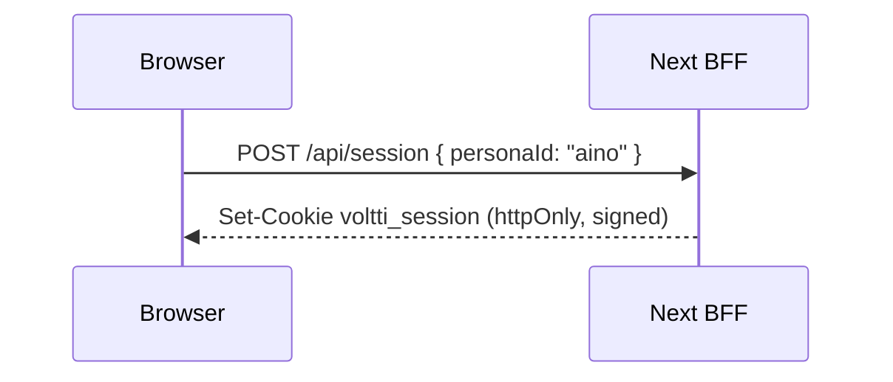

# Security — As-Built Implementation & Flows

How the security layers **actually work today**, in plain language — the flows, what exists, why, and how, so you can understand the system without reading the code. This is the as-built companion to the planned design in [target-architecture.md](target-architecture.md); each slice from the [roadmap](security-principles.md#roadmap) appends a section here as it lands.

**Status:** Slice 1 (identity & sessions) — ✅ built & verified · Slices 2–6 — pending.

---

## Slice 1 · Identity & sessions (P4)

### The problem it solves
Before this slice, "who you are" lived in the browser — the active persona was a `localStorage` value, and the browser called the backend directly with that persona in the URL (`/api/users/aino/orders`). Anyone could edit the request and read another person's data. Identity must be decided by the server, never asserted by the browser (principle **P4**).

### What exists now
A **Backend-for-Frontend (BFF)**: the Next.js server owns the session and is the *only* thing that talks to the Python backend.

| Piece | File | Plain-language role |
|---|---|---|
| Mock login | [src/app/api/session/route.ts](../src/app/api/session/route.ts) | `POST` to sign in as a persona, `DELETE` to sign out, `GET` for "who am I". |
| Session + assertion | [src/lib/session.ts](../src/lib/session.ts) | Stores the signed-in persona in a signed, httpOnly cookie; mints a short-lived signed "identity assertion" for backend calls. |
| BFF proxy | [src/app/api/bff/[...path]/route.ts](../src/app/api/bff/%5B...path%5D/route.ts) | Every browser→backend REST call goes through here; it attaches the assertion and forwards to the backend. |
| Assertion verifier | [backend/.../security.py](../backend/src/voltti_backend/security.py) | Backend checks the assertion's signature and reads the identity from it. Rejects forged/missing-but-malformed tokens. |
| Whoami | `GET /api/me` (backend) | Echoes the verified identity — used to prove the channel. |

The browser no longer holds a backend URL or a `userId` of record. The shared secret (`INTERNAL_JWT_SECRET`) lives only on the servers, so a browser **cannot forge** an identity.

### How a request flows

**Signing in** (selecting a persona in the header):


**An identity-scoped request** (e.g. loading orders):
```mermaid
sequenceDiagram
    participant B as Browser
    participant N as Next BFF
    participant P as Python backend
    B->>N: GET /api/bff/users/aino/orders  (session cookie sent automatically)
    N->>N: read cookie → persona; mint short-lived assertion (JWT, 60s)
    N->>P: GET /api/users/aino/orders  ·  Authorization: Bearer <assertion>
    P->>P: verify assertion (HS256, shared secret) → identity = aino
    P-->>N: orders JSON
    N-->>B: orders JSON
```

The browser only ever sends a cookie; the *assertion* is created server-side and never leaves the server-to-server hop.

### What's enforced vs. still mock/deferred
- ✅ **Enforced now:** identity is server-resolved; the assertion is cryptographically verified **fail-closed** (a missing token = guest, a malformed/forged one = HTTP 401); the browser never reaches the backend directly.
- 🔓 **Deferred to Slice 2:** the backend doesn't yet *reject* a mismatch between the assertion identity and the `userId` in the path (the **ownership** check). Today the persona in the path always equals the session, so data is correct; Slice 2 makes the backend enforce it and stop trusting the path/body `userId`.
- 🎭 **Still a demo crutch:** persona display data (incl. saved address) still ships in the client bundle ([src/lib/users.ts](../src/lib/users.ts)); moving it server-side is later work. The credential is mock (no real IdP) — by design.

### See it working
With both servers running (`./scripts/dev.sh`), from the browser console on the storefront:
```js
await (await fetch('/api/session', {method:'POST', headers:{'Content-Type':'application/json'}, body:'{"personaId":"aino"}'})).json()
// → { personaId: "aino", signedIn: true }
await (await fetch('/api/bff/me')).json()
// → { identity: "aino", signedIn: true }   ← backend identified you from the assertion alone
```
Verified on build: cross-language assertion round-trip (Node `jose` → Python `PyJWT`), `/api/me` returns 401 for a forged token, and the browser network log shows **only** same-origin `/api/bff/*` calls — never the backend on `:8000`.

---

## Slice 2 · Authorization & the tool gateway (P2/P5)

### The problem it solves
Slice 1 made the server *know* who you are; it did not yet stop you from *asking for someone else's data*. The REST routes still keyed off the persona in the URL path (`/api/users/sami/orders`), so a logged-in user could edit the path and read another account — an IDOR. Authorization must be decided server-side against your verified identity, never the path (**P2**, **P4**).

### What exists now (REST ownership — done)
Every identity-scoped route is guarded by an ownership check ([backend/.../api/routes.py](../backend/src/voltti_backend/api/routes.py) · `owner_or_403`):

| Situation | Result |
|---|---|
| No session (guest) calls a user route | **401** — authentication required |
| Aino's session requests **Sami's** data | **403** — you can only access your own data |
| Aino's session requests **Aino's** data | **200** |

Two more fixes landed with it:
- **Orders are attributed to the session, not the request body.** `POST /api/orders` ignores any `userId` in the payload and uses the asserted identity — you cannot place an order as someone else. (Guests place orders attributed to `guest`.)
- **The login surface stopped leaking PII.** `GET /api/users` no longer returns emails — only persona names, labels, and order counts (P6).

```mermaid
sequenceDiagram
    participant B as Browser (logged in as aino)
    participant N as Next BFF
    participant P as Python backend
    B->>N: GET /api/bff/users/sami/orders
    N->>P: GET /api/users/sami/orders · Bearer <aino assertion>
    P->>P: verify assertion → identity = aino; path asks for sami
    P-->>N: 403 Forbidden (identity ≠ resource owner)
    N-->>B: 403
```

### The agent tool gateway (2b — done)
The same principle now covers the **AI agent**, not just REST. The identity assertion rides along to the agent, and the agent's data tools are authorized server-side.

- **Identity reaches the agent.** The CopilotKit route ([route.ts](../src/app/api/copilotkit/route.ts)) mints the assertion from the session and attaches it; the backend `/agui` endpoint verifies it into `AgentDeps.identity` ([main.py](../backend/src/voltti_backend/main.py)).
- **`getMyOrders` / `getReturnInfo` moved into the backend agent** ([agent.py](../backend/src/voltti_backend/agent/agent.py)). They read `deps.identity` — there is **no `userId` parameter** for the model to supply, hallucinate, or be argued into. The generative-UI cards still render client-side.
- **Every user-data tool call passes the gateway** ([policy.py](../backend/src/voltti_backend/agent/policy.py)): each tool has a risk tier (read-only vs user-data); user-data tools are scoped to the authenticated identity and audited. This is the seam where rate limits and abuse scoring attach later.

```mermaid
sequenceDiagram
    participant B as Browser chat (aino)
    participant N as Next /api/copilotkit (BFF)
    participant P as Backend agent (Pydantic AI)
    B->>N: "what have I ordered?"
    N->>P: AG-UI run · Bearer <aino assertion>
    P->>P: verify assertion → deps.identity = aino
    P->>P: model calls getMyOrders → gateway authorizes (tier=user-data, identity=aino)
    P-->>N: aino's orders (scoped; the model passed no userId)
    N-->>B: renders the orders card
```

### What's enforced
- ✅ REST ownership: no session → **401**, another user's data → **403**, your own → **200**; orders attributed to the session; user list carries no email — all covered by tests.
- ✅ Agent tools: identity-scoped data tools run as the signed-in user; the model cannot pass a `userId`; each call is tier-classified and audited.

### See it working
REST (storefront console, logged in as `aino`):
```js
(await fetch('/api/bff/users/aino/orders')).status   // → 200  (your data)
(await fetch('/api/bff/users/sami/orders')).status   // → 403  (someone else's)
```
Agent: ask the assistant *"what have I ordered recently?"* as Aino → it calls the backend `getMyOrders`, scoped to her session, and renders her orders. As a guest, the same question yields a "sign in to see orders" card — the model never sees another user's data.
