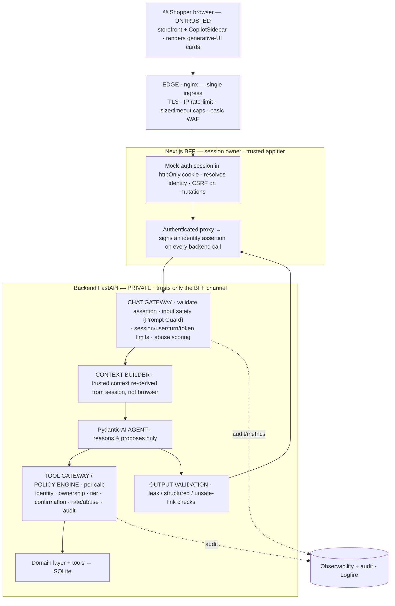

# Target Architecture (security & agentic hardening)

The ratified **target** for Voltti's architecture and security — the output of Step 2 of the effort in [security-principles.md](security-principles.md). It maps every control layer from the guide onto our two-service topology and annotates each trust boundary with the control that guards it.

> **Not yet implemented.** This is the design Steps 3–4 build toward. The system *as built today* is [architecture.md](architecture.md); where the two disagree, this doc is the destination, that one is the present. Every item here traces to a principle (P1–P9) and exists to enforce it — mechanisms are chosen because a boundary needs them, never for their own sake.

## Ratified decisions

1. **Session & identity live in a Next.js BFF.** The browser never calls the backend directly. Next.js owns the (mock-auth) session in an httpOnly cookie, resolves identity server-side, and proxies all backend traffic — REST *and* the agent — attaching a **signed identity assertion**. The backend trusts only this channel. This retires browser-trusted identity (**P4**) and kills the current IDOR.
2. **Identity-scoped data moves to authorized backend tools.** `getMyOrders` / `getReturnInfo` (and any future user-data fetch) become backend agent tools behind the tool gateway, authorized against the session. Only **UI-steering** tools (navigate, highlight, open comparison, render cards) stay in the frontend. **Generative-UI rendering stays client-side** — we move *trust and data* server-side, not the *rendering*. This is the "standard agentic implementation on generative UI" target.

## Target topology

## Where each control layer lives

| Layer (guide §6) | Home in our stack | Enforces |
|---|---|---|
| Edge protection | **nginx** (new single ingress) | TLS, IP rate limits, size/timeout caps, basic WAF; backend stops being directly reachable |
| Session / identity | **Next.js BFF** | Mock-auth session (httpOnly cookie); resolves identity; signs the assertion the backend trusts (**P4**) |
| Chat gateway + input safety | **Backend** (dependency before the agent) | Validate the BFF assertion; Prompt Guard on input; session/user/turn/token limits; abuse scoring (**P7**) |
| Context builder | **Backend** | Re-derive trusted context (owned hardware) from the session; browser-sent context = untrusted hint (**P4/P6**) |
| Agent runtime | **Backend** (Pydantic AI) | Reason and propose only; authorizes nothing (**P2**) |
| Tool gateway / policy engine | **Backend** (wraps every tool call) | Per-call identity, ownership, tier, confirmation/approval, rate/abuse, audit (**P2/P5**) |
| Output validation | **Backend** (agent → response) | Leak/secret/prompt checks, structured-output validation, unsafe-link checks (**P6**) |
| Observability / audit | Cross-cutting (**Logfire**) | Audit every tool/policy decision; the §19 metrics (**P7**) |

## Trust-boundary map

Every boundary gets a control. This is the §5 table grounded in our topology.

| Boundary | Control at the target | Principle |
|---|---|---|
| Browser → edge | nginx: TLS, IP rate-limit, size/timeout caps, WAF | P7 |
| Browser → BFF (session) | Mock-auth session; httpOnly cookie; CSRF protection on mutations; identity resolved server-side | P4 |
| BFF → backend | Signed identity assertion on a private channel; backend rejects unsigned / non-BFF traffic; never trusts browser identity | P4 |
| User input → agent | Prompt Guard / input safety at the chat gateway; input treated as data, never instructions | P3 / P7 |
| Browser context → agent | Demoted to an untrusted hint; trusted context re-derived from the session | P4 / P6 |
| Agent → tools | Tool gateway authorizes every call (identity, ownership, tier, confirmation, rate/abuse) | P2 / P5 |
| Tool output → agent | Field-filtered to need; no full-record dumps | P6 |
| Agent output → user | Output validation (leak / structured / unsafe-link); structured responses for high-risk actions | P6 |
| _(Future)_ retrieved content → agent | Source-labeled untrusted; never instructions; no tool call may originate from it | P4 |
| Every layer | Audit log + metrics | P7 |

## What changes vs. today

1. **nginx is the only ingress** — backend `:8000` is no longer exposed to the browser/host; `NEXT_PUBLIC_BACKEND_URL` goes away.
2. **No browser→backend REST** — all backend traffic flows through the Next BFF with verified identity; this removes the IDOR directly.
3. **Identity is server-resolved** at the BFF — no `userId` from the browser or model as the identity of record. The REST routes stop taking a path/body `userId` as identity; they read it from the validated assertion.
4. **Browser-sent AG-UI context is demoted to a hint** — the backend re-derives the trusted profile from the session.
5. **Identity-scoped data tools move backend-side**, behind the tool gateway; the frontend keeps only UI-steering tools.
6. **A tool gateway wraps every agent tool call** — the policy seam exists now; Step 4 fills in the rules.
7. **Output-validation + audit/observability layers** are added in the backend.
8. **Generative UI is untouched in spirit** — cards and HITL approvals still render client-side from tool results.

## Recognized limits (honest boundaries)

- **Conversation history.** CopilotKit/AG-UI sends history from the client. We treat client-sent history as untrusted and derive nothing security-relevant (identity, authorization, owned hardware) from it — those are re-derived server-side from the session. Full server-side thread persistence is a stretch goal, not a Phase-2 commitment.
- **Streaming output validation.** AG-UI streams over SSE, so full validation of free-form text mid-stream is limited. Structured tool results are validated fully; high-risk content uses structured responses (§16); text gets best-effort checks.
- **The identity assertion is a mock credential, real shape.** A signed short-lived token (HMAC/JWT over the private network) or mTLS between BFF and backend — issuance is mock, enforcement is real; the backend rejects anything without it.

## Deferred to later steps

- **Step 3 — Layer classification:** the per-tool risk-tier table, the data trust labels, and the concrete authz/ownership model (who-can-see-what).
- **Step 4 — Mechanisms:** the nginx config, the Prompt/LLM Guard choice, the Pydantic AI tool-gateway implementation, rate-limit stores, output-validation rules, and the Logfire wiring.

## See also

- [security-principles.md](security-principles.md) — the constitution these layers enforce.
- [architecture.md](architecture.md) — the system as built today (current state).
- [agent-contract.md](agent-contract.md) — the tool surface; the frontend/backend tool split changes here under decision 2.
